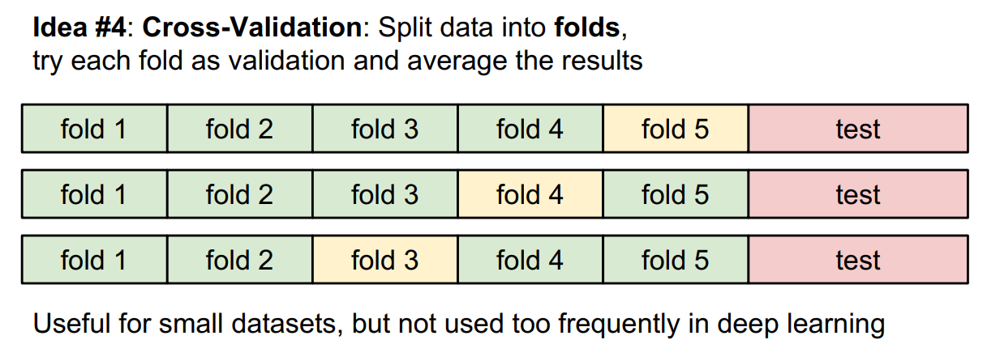
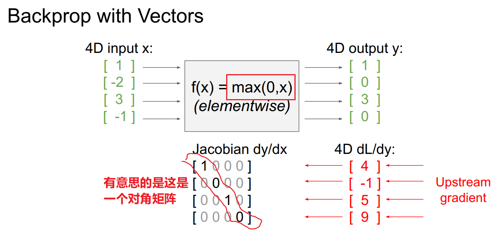
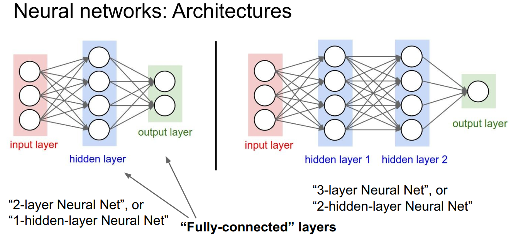

# CS231n笔记

---

[toc]

## 资源网址

- 官方

[课程总网址](http://cs231n.stanford.edu/)

[*教学大纲以及课件等资料下载](http://cs231n.stanford.edu/syllabus.html)

[2017课程视频_Youtube](https://www.youtube.com/playlist?list=PL3FW7Lu3i5JvHM8ljYj-zLfQRF3EO8sYv)

[课程安排 指导 笔记 作业等](http://cs231n.github.io/)

[课程github](https://github.com/cs231n/cs231n.github.io)

## kNN

1. 训练复杂度O(1)，预测复杂度O(N)，和我们想要的相反

2. 参数k的特性：

>白色区域表示没有获得最近邻的投票，在这个区域没有最近的其他点（应该是平票了）

3. 距离的类型

> 1. 上图中图案表示到原点距离相同
> 2. 曼哈顿距离（左）会取决你所选的坐标系统，如果转动坐标轴则曼哈顿距离会发生变化，而欧拉距离不会收到影响
> 3. 如果输入的特征向量中某些值有意义，可能曼哈顿距离会好一点，如果都没有什么明确意义可能欧拉距离自然一点
> 4. 下面是一个曼哈顿距与坐标关系的例子

4. 可以感受一下：[这里是个演示kNN区域图的网站](http://vision.stanford.edu/teaching/cs231n-demos/knn/)

### 超参数Hyperparameters的设置

>- 测试集（test）与验证集（validation)的存在主要是为了把调参与评估泛化能力分为两个相对独立的步骤，体现了正交化思想。
>- 验证集一般用于进一步确定模型中的超参数（例如正则项系数、神经网络中隐层的节点个数，k值等），而测试集只是用于评估模型的精确度（即泛化能力）。
>- 举个例子：假设建立一个BP神经网络，对于隐含层的节点数目我们并没有很好的方法取确定，此时一般将节点数设为某一具体的值，通过训练出相应的参数后，再由验证集取检测该模型的误差；然后再改变节点数，重复上述过程，直到模型在验证集上误差最小。此时的节点数可以认为是最优节点数。但是这只是在验证集上的表现最优而已，事实上在调整节点数的这个过程当中，我们已经不知不觉的让调整节点数的方向往达到验证集最小误差这个目标去了。但事实上，在验证集误差最小通常并不代表在整个数据集上的误差也会小（因为我们是利用验证集上的表现来调整超参数的，因此在调整超参数的过程当中，验证集的误差在不断减少是必然的），因此需要另外一个数据集来测试模型真正的泛化能力，即测试集。测试集是在模型确定好所有参数之后，根据测试误差来评判这个模型好坏的一个数据集。

#### 交叉验证法

> - 先分出test，然后剩下部分分成5份，每一份轮流作为validation，这样就能够找到5组超参数，然后可以从这5组超参数中看哪种出现多即可判断哪个**超参数最稳定**。
> - 注：该方法一般不用于深度学习，因为如果这样消耗时间极大

### kNN on images never used

1. 准确率低，predict算法复杂度大
2. 距离在图像上没有什么意义，下面图2、3、4到1的距离是一样的。这说明如果对于一个完全不一样的人，我们用2、3、4的操作可以让他和图1之间的距离为0.

3. curse of dimensionality（维数灾难）

## 线性分类器

[模拟网站](http://vision.stanford.edu/teaching/cs231n-demos/linear-classify/)

> 对于下图中的偏差元素b，如果猫的数量比较多，那么猫的b会比较高。

### Loss Functions （损失函数或代价函数）

loss functions用来评价线性分类器中W好坏的方法

> 如下面三个图所示，第一列中输入猫的图像猫得分只有2.9，比不过deer等得分是不太好的。而第二列中车得分最高，说明线性分类器对车是好分类器，而第三列青蛙的分类器在输入青蛙图像时反而青蛙得分最低，这是个对青蛙失败的分类器。
>
> 当然这是我们认为通过看得分来判断的，实际编程我们需要一个办法来衡量线性分类器中W是好是坏，这个办法就是Loss Functions。

!

​	loss function种类有很多，下面是其中的几种：

#### 第一种——Multiclass SVM loss  

- **基本概念**

​	下面$y_j$表示对于第j类其对应的标签，其实就是和j是一样的数字，只是是确定为第几类别。

以及最终，Loss over full dataset is average is:  
$$
L=\frac{1}{N} \sum_{i=1}^{N} L_{i}
$$

**事实上，上面的那个+1应该是加 Δ**，即真正的Li是
$$
L_{i}=\sum_{j \neq y_{i}} \max \left(0, s_{j}-s_{y_{i}}+\Delta\right)
$$

> 这个Δ 表示一种余量：
>
> The SVM loss function wants the score of the correct class $y_i$ to be larger than the incorrect class scores by at least by Δ (delta). If this is not the case, we will accumulate loss.
>
> 具体看这里吧[网址](http://cs231n.github.io/linear-classify/#svm)
>
> 而由于 Δ带来的影响是相对的，好像没有什么大的影响。
>
> 
>
> 我认为的 Δ作用：
>
> 1. 假设一开始所有W都很小，那么$L_i$在 Δ的作用下结果应该是（种类数-1）* Δ，而不是出现0。这是一种检错判断操作。

- **使得loss=0的W是否唯一**	？

  显然不是，2W以及4W等都行。。。。。

#### Regularization  

- 由上一点使loss=0的W不唯一，我们需要选出比较好的W。

> 1. 由于我们希望的分类器效果不是在训练集上最好，而是在我们实际工作中好，我们需要防止**过拟合**即下图蓝线，即我们更希望得到下面绿线的结果。
>
> 2. 根据奥卡姆剃刀原理：切勿浪费较多东西去做，用较少的东西，同样可以做好的事情

​	因此，我们引入了Regularization  项，以实现惩罚来防止过拟合。

> 小思路：
>
> 如果过拟合或者模型复杂，这时候可以想到的操作：1.降维 2.引入惩罚

- 这个Regularization 有很多种，如下图L2,L1以及……

  

> 用哪种取决于当前工作对于复杂度的定义
>
> - L1会偏向于使得特征由少量元素决定
> - L2会偏向于使得尽可能多的元素决定

- 下面是这个Regularization 的作用体现，即让更多的元素参与决定，而不是只让某些特点的元素决定，这样有更好的鲁棒性。

  

  

#### 第二种——Softmax Classifier (Multinomial Logistic Regression)  

由下式子表述：
$$
L_{i}=-\log P\left(Y=y_{i} | X=x_{i}\right)
$$
其中

即输入猫的图片时输出猫的概率的倒数的负对数。计算可参考下图：

#### 对比

> svm与softmax对比：
>
> SVM其实并不在乎每个类别得到的绝对得分大小，举个例子说，我们现在对三个类别，算得的得分是[10, -2, 3]，实际第一类是正确结果，而设定，那么10-3=7已经比1要大很多了，那对SVM而言，它觉得这已经是一个很标准的答案了，完全满足要求了，不需要再做其他事情了，结果是 [10, -100, -100] 或者 [10, 9, 9]，它都是满意的。
>
> 然而对于Softmax而言，不是这样的， [10, -100, -100] 和 [10, 9, 9]映射到概率域，计算得到的互熵损失是有很大差别的。所以Softmax是一个永远不会满足的分类器，在每个得分计算到的概率基础上，它总是觉得可以让概率分布更接近标准结果一些，互熵损失更小一些。
>
> 实际中可能没有什么差异……

### Optimization  （优化）

#### 梯度下降法

原理在这里不写了，可以去看吴恩达机器学习。

> 值得一提的是数值法计算可以用来作为解析法的debug。即下图所说的。

##### 随机梯度下降

如果全部数据都计算一遍，在数据库很大的情况下就要计算很久，所以可以抽取数据集中的一部分（minibatch），如2的n次幂位置的数

## Backpropagation ——反向传播算法

一句话：正向数值计算，反向梯度计算，数值计算的数值会被带入到梯度（导数）的计算公式中。

详细阐述大概是把节点（Node）当成一个个模块，这些模块可以是简单的+、-、也可以是max、min或别的复杂点的解析式，然后通过对每一模块正向数值数值计算功能和反向导数计算功能进行具体编程，即可实现复杂的梯度计算的简单化。

原理是导数的链式法则。

### 4个简单模块示例

> 这个max门就是只有max值的地方有导数为1,其余为0

### 向量的导数

> 可以看到向量的模块化也是可以表示成式子，编程出来的

有意思的是如果是Node是求max，那么就会变成一个对角矩阵：

## 神经网络

神经网络类型有很多种

​													上面这幅图画的是fully-connected networks

- 神经网络中**要有非线性部分**，否则就只有一层了，如下图所示

### 卷积神经网络和神经元对比

### Activation functions ——激活函数

激活函数是非线性的，有如下图等：

> 听说真的神经元信号中有和`ReLU`比较接近的

### 神经网络的层数

越多层，分得越细，越容易过拟合。

**注：**

[可以体验的网站](https://cs.stanford.edu/people/karpathy/convnetjs/demo/classify2d.html)

## 卷积神经网络Convolutional Neural Networks  

一个基本的神经网络结构如下图

更详细的具体结构可以由以下表示：

### 用到的基础知识：

>*你需要知道：*
>
>结构基础：
>
>- 卷积层Convolution Layer  ——相当于做滤波或特征提取
>- 池化层Pooling layer  ——相当于做下采样（subsampling）
>- 全连接层Fully Connected Layer  ——和前面线性分类器是一样的，是多层的fully-connected networks
>
>
>
>算法基础：
>
>- 激活函数（如ReLU）
>- 反向传播——计算梯度
>- 梯度下降——优化算法，配合loss function训练神经网络

下面讲一下结构基础中的卷积池化，算法基础看前面。

### 卷积层

- 下图展示的是一个5\*5\*3的卷积核（filter）与原图像卷积生成activation map的过程，当然**卷积过程其实是要\+b的**

- 实际计算操作如下：

> 别问卷积计算中卷积核为什么不用翻转180°。。。。

- 多层卷积核

我们知道卷积核是对特征进行提取，多个卷积核就相当于从不同方面的特征进行提取，如视觉，听觉，嗅觉等对世界进行观察。。。

多层卷积核生成的activation map也是多层的

**一般这个 层数会想要是和$2^n$有关系的**

- 实际上从一个activation maps到另一个中间还有激活函数

#### 运算的一些说明（具体怎么动不写）

1. 操作有步长：stride  ，和增加边缘宽度（如在外围加一圈0）：pad  
2. 当步长使得卷积不能完整在一个平面上计算，那么我们不会用这个步长

（这种情况下一般我们也不会用补border 来使其可以运算）

3. 生成的activation maps尺寸和原来的关系

​	

4. 我们知道卷积每次边沿都只会进行一次卷积运算，而中间会参与多个和filter相乘的步骤，可以看到信息量在减小。——这是我们不想要看到的，我们不希缩小得太快，所以可以在周边一圈0或一圈镜像之类的。

5. 1*1的卷积核实际上在深度上做了运算，而不是什么都没有干或者只干了放到缩小。

> 专业术语
>
> 5x5 filter”也可以说成是5x5 receptive field  （感受野）

### 池化

- 池化相当于一个下采样过程

#### 池化的运算

- 同卷积类似，池化也有步长stride  
- **池化深度=原深度**

- 下面是一个2*2，步长为2的max pooling

- 另外值得说明的是池化一般**不会扩展边界**，因为池化显然是希望变小
- 池化一般也**不想要重合**。
- 池化运算的结果总结

> 附：
>
> 1. 我们知道池化和跨步都是用来下采样的，那么用跨步能否代替下采样，这是有可能的
> 2. 池化常用取得区域内最大值

## 卷积神经网络的训练

### 1.激活函数的说明

> 几个基本认识：
>
> - 饱和：斜率为0，那么反向传播时会将梯度变0，数据无法训练
>
> - 0均值：
>
>   这个是我们希望x有正有负，以达到比较好的梯度下降效果。
>
>   比如当上一级所有x输出（如sigmoid激活函数）都是正的时候，对本级会有如下图所示的问题：
>
>   
>
>   
>
>- 计算效率

1. sigmoid

2. tanh

3. ReLU

> <=0时，ReLU梯度为0，不更新，是dead ReLU
>
> people like to initialize ReLU neurons with slightly positive biases(e.g. 0.01)
>
> 另外=0可以取梯度为0

4.Leaky ReLU 和 PReLU

> PReLU的$\alpha$是超参数

5. ELU

6. Maxout "Neuron"

#### 小结

### 2.数据预处理 Data Preprocessing  

根据第一点激活函数说明中谈到过的理论，你想要的数据是**零均值**的

> 这个不同神经网络预处理的方法是不一样的

### 3.权重初始化 Weight Intialization

> 基本认识：
>
> - 我们希望数据X呈现0均值，方差大点
>
> - 用**小随机数**初始化问题
>
>   ——对于层数较多的神经网络不好，看下面这附图当每一层W都很小，则计算出来的每一个X都变小，最后的数据X都是非常小的，再想想训练时x都≈0，就能知道基本就是no learning了
>   
>   
>   
> - 用**大随机数**初始化的问题
>
>   ——如果你的激活函数是有饱和的，就应该意识到有可能造成数据X较大，梯度为0，又no  learning了
>
>   
>   
> - **“Xavier” Initialization**  
>
>   一个不错的初始化方法
>
>   
> >但是对ReLU：
> >
> >由于ReLU每次都只有一半能够传递过去：
> >
> >
> >所以要变成$std=sqrt(2/Din)$：
> >
> >

·