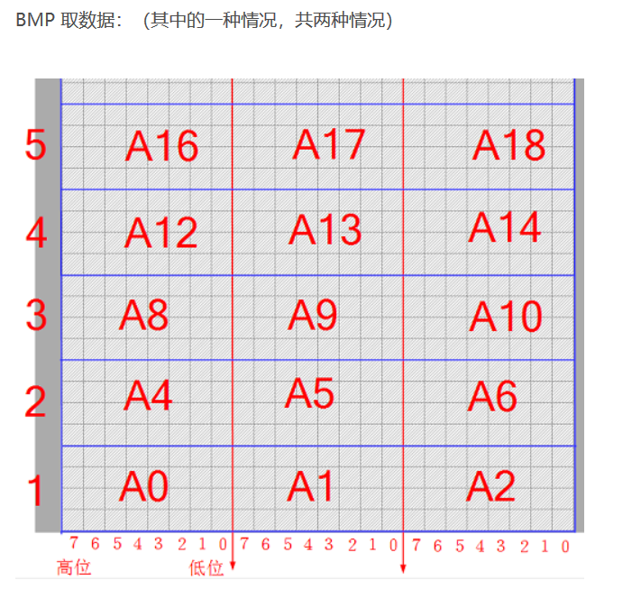

# 图片类型格式知识

---

[toc]

## bmp

[基础知识,建议没基础看这个，有基础看下面那个 ](bmp图片格式详解)，如文件头，位图信息头等。

[维基百科详细点](https://zh.wikipedia.org/wiki/BMP)

[bmp结构解析](https://blog.csdn.net/sxtdzj/article/details/86232702?depth_1-utm_source=distribute.pc_relevant.none-task&utm_source=distribute.pc_relevant.none-task)

- 所有几个字节的顺序都是反的，如AA BB CC实际是CC BB AA
- 16进制中颜色书写顺序是GBR

- 每两个字节表示一个像素。阵列中的第一个字节表示位图左下角的象素，最后一个字节表示位图右上角的象素。

- bmp每一行结束都有可能有00，用来补到$width*3/4$为整数。

