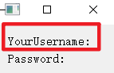

# PyQt5的笔记

---

[toc]


[教程出处](https://zhuanlan.zhihu.com/p/75673557)


## 第一部分——三种毛坯房

### 一些说明

[QT中QWidget、QDialog及QMainWindow的区别](https://blog.csdn.net/asklw/article/details/70767983)

>这3个基类从名字上看分别是 "微件"、"对话框"、"主窗口，
>
>QWidget类是所有用户界面对象的基类，QMainWindow和QDialog都是QWidget的子类。窗口部件是用户界面的一个基本单元：它从窗口系统接收鼠标、键盘和其它事件，并且在屏幕上绘制自己。每一个窗口部件都是矩形的，并且它们按Z轴顺序排列。一个窗口部件可以被它的父窗口部件或者它前面的窗口部件盖住一部分。 
>
>   QMainWindow  类提供一个有菜单条、锚接窗口（例如工具条）和一个状态条的主应用程序窗口。主窗口通常用在提供一个大的中央窗口部件（例如文本编辑或者绘制画布）以及周围  菜单、工具条和一个状态条。QMainWindow常常被继承，因为这使得封装中央部件、菜单和工具条以及窗口状态条变得更容易，当用户点击菜单项或者工具条按钮时，槽会被调用。
>
>   QDialog类是对话框窗口的基类。对话框窗口是主要用于短期任务以及和用户进行简要通讯的顶级窗口。QDialog可以是模态对话框也可以是非模态对话框。QDialog支持扩展性并且可以提供返回值。它们可以有默认按钮。QDialog也可以有一个QSizeGrip在它的右下角，使用setSizeGripEnabled()。 
>
>   QDialog  是最普通的顶级窗口。一个不会被嵌入到父窗口部件的窗口部件叫做顶级窗口部件。通常情况下，顶级窗口部件是有框架和标题栏的窗口（尽管使用了一定的窗口部件标记，创建顶级窗口部件时也可能没有这些装饰。）在Qt中，QMainWindow和不同的QDialog的子类是最普通的顶级窗口。
>
>   如果是顶级对话框，那就基于QDialog创建，如果是主窗体，那就基于QMainWindow，如果不确定，或者有可能作为顶级窗体，或有可能嵌入到其他窗体中，则基于QWidget创建。
>   当然了，实际中，你还可以基于任何其他部件类来派生。看实际需求了，比如QFrame、QStackedWidget等等。


### QWidget

#### 方法

- show
- resize(300,400)
- setWindowTitle('name')     设置窗口名称
- .close()退出自身


### QDialog

#### 方法

- show
- exec\_\(\) 模态显示（若使用exec_()的话，那么显示出来的注册界面就是模态的，意思就是当前只能对该注册界面进行操作，只有关闭了该界面才能对其他界面进行操作）


## 第二部分——控件说明及其方法

### QLabel

#### 样式



#### 说明

- 创建对象时候可以设置内容 label = QLabel(‘HelloWorld’) 


#### 方法

- setText('内容')


### QPushButton

#### 样式

> 可点击按键


#### 说明

- 创建对象时赋值内容label = QLabel(‘HelloWorld’) 


#### 方法

- setText('内容')
- .setEnabled(True/False)方法（会把按键设置成可/不可点击）


#### 信号

- .clicked——点击
- .pressed——按住
- .released——松开


### QLineEdit

#### 样式

> 同QQ密码登录的输入密码的那一行一样

#### 说明


#### 方法

- .setPlaceholderText方法(灰色提示文字，键入消失)
- .textChanged方法(就是文字改变信号)
- .text()方法(就是获取文本内容)
- .clear()方法(清除文本内容)
- setEchoMode(QLineEdit.Password)方法(将普通输入框中的文字变成原点，和QQ输入密码一样)


### QTextEdit

#### 样式

> 长文本框，不像LineEdit那样是一行的


#### 说明


#### 方法

- setText()用来设置文本
- toPlainText()用来获取文本


#### 信号

- .textChanged


### QTextBrowser

#### 样式

同QTextEdit但是不能编辑


#### 说明

> 浏览框会自动执行Html代码。


#### 方法

- setText()用来设置文本


## 第三部分——控件管理器

### QVBoxLayout——垂直管理器

#### 说明

>QVBoxLayout---垂直对齐(好像有的是左对齐(如本例子)，有的是居中对齐的)
>步骤：
>1、先实例化一个垂直布局管理器QVBoxLayout
>2、通过调用addWidget()方法来将控件一个个添加到垂直布局中，最先添加的出现在最上方
>3、将self.v_layout设为整个窗口的最终布局方式。
>
>4、垂直（水平）布局管理器还可以管理别的水平（垂直）管理器


#### 代码示例

```
class Demo(QWidget):

    def __init__(self):
        super(Demo, self).__init__()
        self.user_label = QLabel('YourUsername:', self)
        self.pwd_label = QLabel('Password:', self)

        self.v_layout = QVBoxLayout()  # 1
        self.v_layout.addWidget(self.user_label)  # 2
        self.v_layout.addWidget(self.pwd_label)  # 3

        self.setLayout(self.v_layout)  # 4


if __name__ == '__main__':
    app = QApplication(sys.argv)
    demo = Demo()
    demo.show()
    sys.exit(app.exec_())
```


### QHBoxLayout——水平管理器

参考垂直管理器QHBoxLayout


### QFormLayout——表单管理器

#### 方法

- addRow(左边部件, 右边部件)——一直addRow会从上往下的放


### QGridLayout——网格管理器

#### 说明

> - 和坐标系一样的管理方法
>
> - QGridLayout的addWidget()方法遵循如下语法形式：addWidget(widget, row, column, rowSpan, columnSpan)
> - widget就是要添加的控件；row为第几行，0代表第一行；column为第几列，0代表第一列；rowSpan表示要让这个控件去占用几行(默认一行)；columnSpan表示要让这个控件去占用几列(默认一列)。


#### 参考代码

```
self.grid_layout.addWidget(self.user_label, 0, 0, 1, 1)         # 2
self.grid_layout.addWidget(self.user_line, 0, 1, 1, 1)
self.grid_layout.addWidget(self.pwd_label, 1, 0, 1, 1)
self.grid_layout.addWidget(self.pwd_line, 1, 1, 1, 1)

# 前四行由于有默认值也可以写成如下：
# self.grid_layout.addWidget(self.user_label, 0, 0)
# self.grid_layout.addWidget(self.user_line, 0, 1)
# self.grid_layout.addWidget(self.pwd_label, 1, 0)
# self.grid_layout.addWidget(self.pwd_line, 1, 1)
```


## 第四部分——消息框

>1、实例化一个QPushButton并将clicked信号与自定义的show_messagebox槽函数连接起来，这样点击按钮后，信号发出，槽函数就会启动
>2、基本用法如下：QMessageBox.information(QWidget, 'Title', 'Content', buttons)
> 常见的按钮种类有以下几种：    QMessageBox.Ok  QMessageBox.Yes  QMessageBox.No  QMessageBox.Close   QMessageBox.Cancel  QMessage.Open  QMessage.Save
>3、如果你没有显示指定信息框的按钮，那信息框会自己默认加上合适的按钮上去


>另外，除了information类型的message框，还有QMessageBox.question 问答框
>     QMessageBox.warning 警告框
>     QMessageBox.critical 错误框
>     QMessageBox.about 关于框


### 按钮类型

- QMessageBox.Ok 
- QMessageBox.Yes 
- QMessageBox.No 
- QMessageBox.Close 
- QMessageBox.Cancel
- QMessage.Open
- QMessage.Save


### message类型

- QMessageBox.question 问答框
- QMessageBox.warning 警告框
- QMessageBox.critical 错误框
- QMessageBox.about 关于框


### 与信号和槽函数的联动案例

```
import sys
from PyQt5.QtWidgets import QApplication, QWidget, QPushButton, QMessageBox


# key points
# 当点击消息框上的某个按钮之后，会返回这个按钮，而这里将返回的按钮结果保存在choice中
class Demo(QWidget):
    def __init__(self):
        super(Demo, self).__init__()
        self.button = QPushButton('Click Me!', self)
        self.button.clicked.connect(self.show_messagebox)

    def show_messagebox(self):
        choice = QMessageBox.question(self, 'Change Text?', 'Would you like to change the button text?',
                             QMessageBox.Yes | QMessageBox.No)  # 1

        if choice == QMessageBox.Yes:                           # 2
            self.button.setText('Changed!')
        elif choice == QMessageBox.No:                          # 4
            pass


if __name__ == '__main__':
    app = QApplication(sys.argv)
    demo = Demo()
    demo.show()
    sys.exit(app.exec_())
```


## 第五部分——信号与槽函数

### 说明

>- self.button1.clicked.connect   and     disconnect
>- clicked(按钮被点击)是该控件的一个信号，connect()即连接
>- self.change_text即下方定义的函数(我们称之为槽函数)。
>- 所以通用的公式可以是：widget.signal.connect(slot)
>- 可多对一，可一对多


### 方法

- widget.signal.connect(slot)
- widget.signal.disconnect(slot)

自定义信号

- ```
  my_signal = pyqtSignal()
  ```

- emit()方法激活自定义信号


### 代码示例


```
import sys
from PyQt5.QtWidgets import QApplication, QWidget, QPushButton


class Demo(QWidget):                                            # 1
    def __init__(self):
        super(Demo, self).__init__()
        self.button1 = QPushButton('hello world', self)                # 2
        self.button1.clicked.connect(self.change_text)           # 3绑定click信号与槽函数

    def change_text(self):
        print('change text')
        self.button1.setText('goodbye world')                             # 4
        self.button1.clicked.disconnect(self.change_text)        # 5解绑槽函数(不必要)


if __name__ == '__main__':
    app = QApplication(sys.argv)
    demo = Demo()                                               # 6
    demo.show()                                                 # 7
    sys.exit(app.exec_())
```